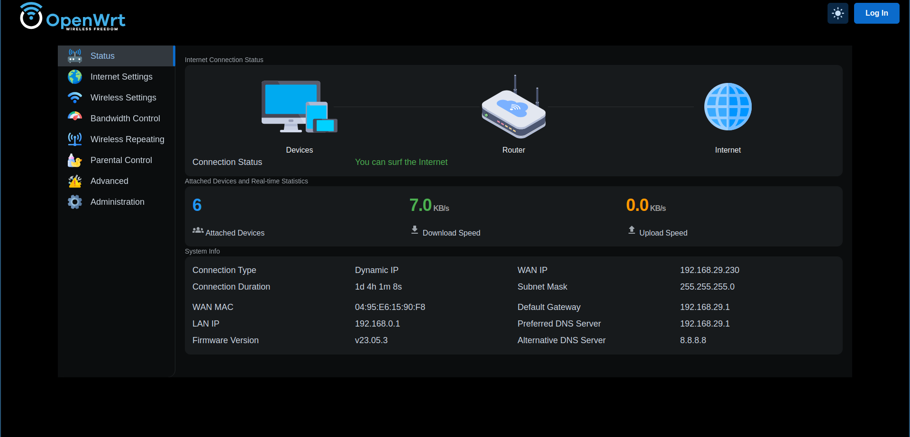

MuCI is a user-friendly web interface designed to simplify the configuration of OpenWrt devices. It aims to provide an intuitive and accessible way to manage network settings, packages, and other system parameters without requiring advanced technical knowledge.

### Features

-  Intuitive Dashboard: Provides a clear overview of the device's status, including network connections, CPU usage, and storage.

- Simplified Network Configuration: Easily manage Wi-Fi settings, LAN, WAN, and other network interfaces.

- System Information: Display detailed hardware and software information.

- Security: Implement basic security measures to protect the device.
### Contributing
Contributions to Muci are welcome! Please follow these guidelines:

- Fork the repository.
- Create a new branch for your feature or bug fix.
- Commit your changes and push to your branch.
- Submit a pull request.
### License
[ Apache-2.0 license]

### Contact
For support or inquiries, please contact [kamlendrax@gmail.com].
### Screenshots

